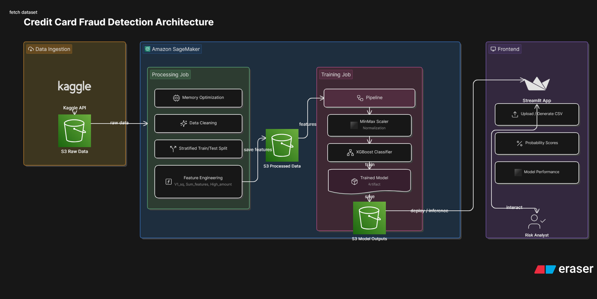

#  End-to-End Credit Card Fraud Detection Pipeline

### AWS SageMaker | XGBoost | Streamlit | MLOps
### An automated SageMaker-integrated solution for identifying fraudulent transactions using XGBoost and Streamlit.

##  Project Overview

This project implements a robust machine learning pipeline designed to handle extreme class imbalance and deliver high-precision predictions. The system spans from automated data ingestion in AWS S3 to a user-facing Streamlit dashboard, and bridges the gap between data science and business utility.

##  Tech Stack

- Cloud: AWS (SageMaker, S3, IAM)
- ML: XGBoost, RandomSearchCV, Scikit-Learn
- Data: Pandas, NumPy (with heavy memory optimization)
- Interface: Streamlit, Matplotlib, Seaborn

##  System Architecture
The project is built on the Amazon SageMaker ecosystem, ensuring scalability and reproducibility.

-   **Data Ingestion:** Automated Kaggle API integration to fetch raw data (credit card dataset) directly into Amazon S3.

-   **Processing job (SageMaker):**  
    _Memory Optimization_: Downcasting numerical types to handle large datasets efficiently.  
    _Data Cleaning_: Handling missing values and outliers.  
    _Splitting_: Stratified Train/Test splitting to maintain class distribution.  

-   **Feature Engineering:** Derived from statistical data analysis (`V1_sq`, `Sum_features`, `High_amount`) to capture non-linear relationships in fraud patterns.
  
-   **Training Job (SageMaker):** Pipeline normalization+XGBoost classifier trained using optimal hyperparameters.
  
-   **Frontend:** Streamlit application for real-time inference and visualization that allows risk analysts to upload batch CSVs and receive instant probability scores.



## Key Technical Challenges & Solutions

**Handling Extreme Class Imbalance**:  
- Focused on optimizing the Confusion Matrix to minimize both False Negatives and False Positives.  
- Utilized scale_pos_weight, colsample_bytree in XGBoost.  

**Model choosing**:  
XGBoost Classifier handles well extreme class imbalance, it has a parameter `scale_pos_weight` allowing the model to pay more attention to the minority class (fraud). Since it is tree-based, it doesn't care about the exact distribution of the data, and it is well performs on tabular data as is this case.  

**Hyperparameter Optimization (HPO)**:  
To save on cloud costs and execution time, I performed RandomizedSearchCV locally/offline to find the optimal configuration.   
These "best-fit" parameters were then injected into the SageMaker Training Job for final model persistence.  

**Production-Ready Preprocessing**:  
A common "train-serving skew" occurs when the model expects cleaned data but receives raw data.  
I exported the specific cleaning parameters into a separate configuration file. This ensures that the Streamlit app applies the exact same transformations to user-uploaded data as were applied during training, avoiding data leakeage.   
    

## 📊 Model Performance

To minimize financial risk, the model was optimized for **Recall** and **ROC-AUC** to ensure that as few fraudulent transactions as possible go undetected.
| Metric | Score |
| :--- | :--- |
| **ROC-AUC** | 0.96 |
| **Precision (Fraud)** | 0.90 |
| **Recall (Fraud)** | 0.77 |


### Model Evidence

-   **Confusion Matrix:** Located in the "Model Evidence" tab of the live app, showing minimal False Negatives (missed fraud) and False Positives (disturbed real clients).
    

## 📂 Repository Structure

Plaintext

```
├── app.py                     # Streamlit Frontend
├── preprocessing_utils.py     # Shared inference logic
├── scripts/
│   └── preprocessing.py       # SageMaker Processing Job script
│   └── training.py            # SageMaker Training Job script
├── notebooks/
│   └── sagemaker_pipeline.ipynb # Full AWS Pipeline execution
├── model.joblib               # Trained XGBoost model
├── preprocessor_meta.joblib    # Frozen training parameters (Medians/Bounds)
└── requirements.txt           # Environment dependencies

```

## 🎮 How to Use

1.  **Visit the App:** https://sagemaker-fraud-detection-5s7pyzqsstgemupv6amhn4.streamlit.app/
    
2.  **Upload Data:** Use the provided `raw_to_test.csv` in the repo or generate random batch to test.
    
3.  **Analyze:** Review the flagged transactions and explore the model metrics in the secondary tab.
    

----------

**Author:** Anastasia Mishchenko

**Contact:** https://www.linkedin.com/in/anastasia-mishchenko-2b6973104/
